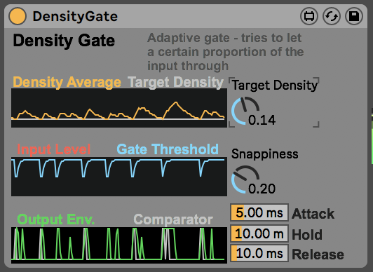

# Density gate

**Density Gate** is a gate that tries to be open for a certain proportion of the time.

It works like this:
* You set a target how much it should be open on average.
* The gate keeps track of how much it is open. If it is open more than the target, then the gate threshold goes up, if it is open less than the target, the threshold goes down, to let more signal through.
* There are controls for how quickly the average openness is updated, and how quickly the threshold responds to this. (These could probably be merged into one control quite sensibly, they have similar effects)
* There are controls for the attack, hold and decay of the gate - it's a very simple envelope, quick enough to get clicky if you want.

It's useful for things like:
* Having a background texture, but punching some holes in it. The adaptation means that you don't have to track how the texture evolves to get the desired amount of stuff coming through.
* Getting little snippets of stuff to come through into big washes of reverb
* Crunching up drums.
