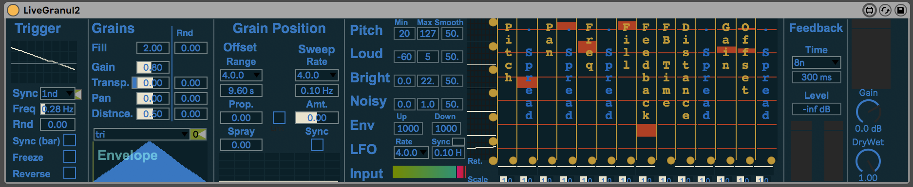
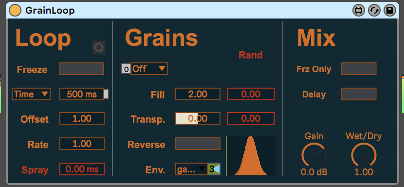

# Grain effects
This is a small collection of grain based effects, initially based on the GMU GMEM granulation tools.

## LiveGranulator2

LiveGranulator2 starts as a fairly normal grain delay, with controls for when they are triggered, and what shape and size they are. There's then a section for where in the buffer grains are pulled from.

Where it gets interesting is the modulation matrix, where features of the input signal (via analyze~) can be used to modulate most of the playback parameters - pitch, rate, feedback, offset etc.

This leads to some quite wonky responses - great fun, but not the easiest thing to control.

## GrainLoop

GrainLoop is a simpler proposition - it's a circular buffer from which grains are played. It works as a grain delay, but with a button to freeze the current buffer and granulate through it. There are some extra controls for sweeping through at a set rate, and adding grain favourites like spray.
