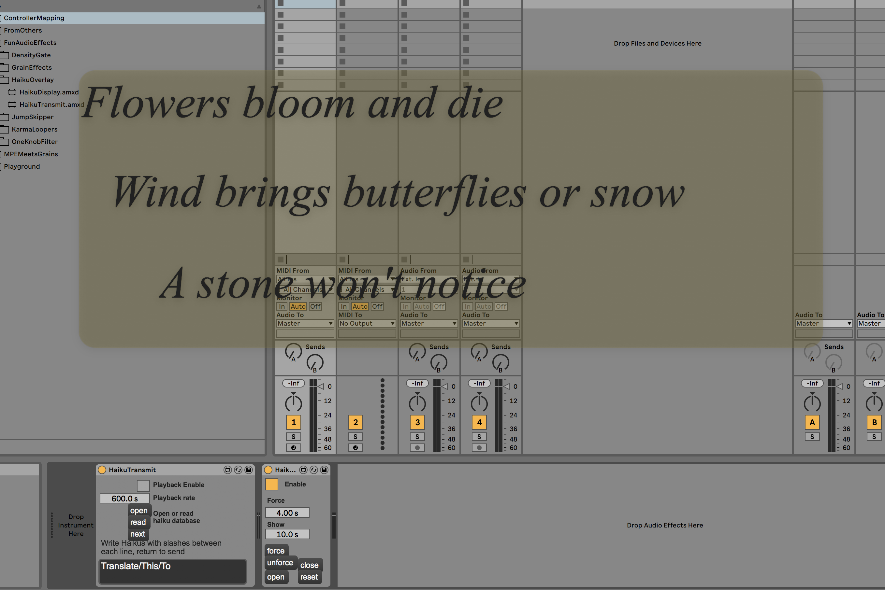
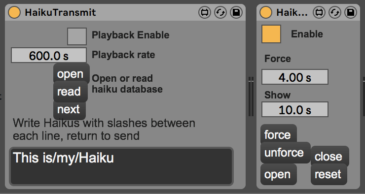

# Haiku overlay



A slightly silly pair of patches, that do exactly what it says on the tin - overlays a haiku on the screen. It works using `mxj.maxhole`, so you can have one sender and several receivers on a network.



The Transmitter can load in a file full of haiku, and play them back every X seconds. You can also type it in directly in the text box at the bottom.

The receiver tries to pop up a transparent window with the haiku in. For `Force` seconds, this stops any mouse clicks getting through, and grabs all the focus. After that, the window is still there, but you can click back to your live set.

It's almost a score more than a plugin - how to co-performers respond to textual material while playing.

## File Format

The file format is a bit arcane, but follows `coll`, each haiku is on a line, and each line of the haiku is surrounded by quotes, e.g.:

```
1, "do caterpillars" "think butterflies beautiful?" "find your own cocoon";
2, "in a new bucket" "the same water..." "looks so fresh!";
3, "Flowers bloom and die" "Wind brings butterflies or snow" "A stone won't notice";
4, "even wild roses" "of a downtrodden land" "reach enlightenment";
```
