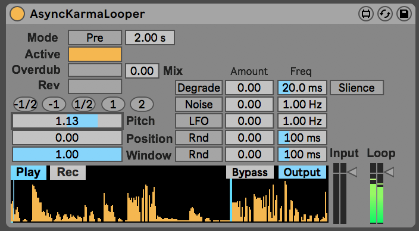

# AsyncKarmaLooper

This is a fairly direct wrapper around the excellent [karma~](https://github.com/rconstanzo/karma) external by Rodrigo Constanzo & raja & pete.

It's a looper, that allows you to grab a chunk of audio and keep playing it. This version has nothing much to do with set temp (hence Async), so it's probably not a good idea to try and keep it in time.

There are two ways to grab a bit of audio, based on the `Mode` switch:
* **Pre** mode: when this is on, pressing the Active button will loop the previous `X` seconds of audio.
* **Post** mode. When this is on, pressing the Active button *starts* capture, and then pressing the `Grab` button starts the loop.

So far so normal. There's an `Overdub` button to overdub the loop, and the `Mix` button controls how much of the existing signal is kept. The `Rev` button reverses playback direction, and the `Pitch` button smoothly controls pitch from doublespeed forwards to doublespeed backwards. `Window` can be used to play a smaller portion of the buffer, and `Position` chooses where this is.

The modulators on the right get a bit more interesting:
* **Degrade** is particularly fun - it replaces chunks of the buffer with either `Silence` or the `Input` signal. This means you can either gradually punch out bits of the loop (e.g. Disintegration Loops), or you can keep a buffer going round that gradually evolves to match the signal coming in.
* **Noise** and **LFO** both control the pitch, either jumping around or smoothly modulating.
* The two **Rnd** buttons add noise to the `Position` and `Window` parameters respectively.

And that's it! (So far).

It's particularly fun:
* To grab a chunk of audio and let it slowly drift to match what's coming in.
* To use a combination of `Overdub` and `Degrade` to record into a loop as the pitch is being modulated
* To use `Reverse` along with `Overdub` to record some bits forwards and backwards
* To set up a pretty short loop with `Degrade` on to get a constant rhythm that will mutate every so often.
