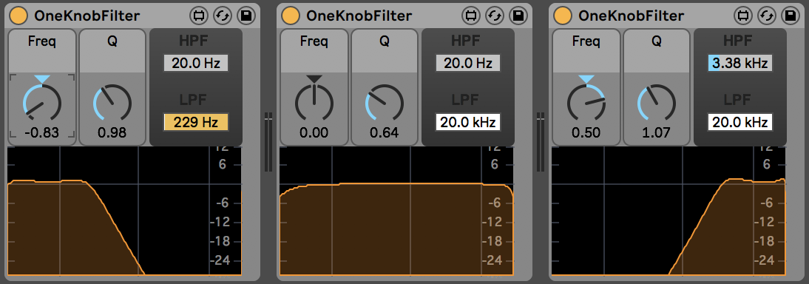

# OneKnobFilter

I often found myself wanting to be able to either filter a sound upwards with a high pass, or down with a lowpass, and wouldn't it be nice if one knob did all of that. This is that knob.

If it's in the middle, everything goes through. Turn it leftwards and its a low pass (down to nothing at extreme left), turn it right and its a highpass (again, up to nothing at extreme right).

(A bandpass does similar things, but I wanted something where you could let *everything* through in the middle)

Don't expect any fancy filter chops - its just using `cascade~`.
